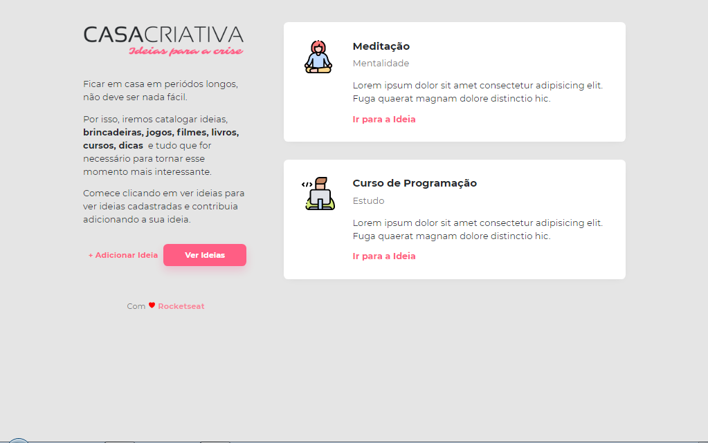

<h1 align="center">
  
</h1>

  <a href="#-tecnologias">Tecnologias</a>&nbsp;&nbsp;&nbsp;|&nbsp;&nbsp;&nbsp;
  <a href="#-projeto">Projeto</a>&nbsp;&nbsp;&nbsp;|&nbsp;&nbsp;&nbsp;
  <a href="#-como-executar">Como executar</a>

  

## ✨ Tecnologias

Esse projeto foi desenvolvido com as seguintes tecnologias:

- HTML, CSS e JavaScript, Veja na documetação [W3Scholls](https://www.w3schools.com/) e na [MDN Web Docs](https://developer.mozilla.org/pt-BR/)  
- [Node.js](https://nodejs.org/en/)
- [Nunjucks](https://mozilla.github.io/nunjucks)
- [SQLite](https://www.sqlite.org/)

## 💻 Projeto

Casa Criativa é o app de adicionar ideias no seu cotidiano

## 🚀 Como executar

- Clone o repositório `git clone https://github.com/pedroduarte2005/workshopdev-rocketseat.git`
- Instale as dependências com `yarn` ou `npm install`
- Inicie o servidor com `yarn dev` ou `npm run dev`

Agora você pode acessar [`localhost:3333`](http://localhost:3333) do seu navegador.